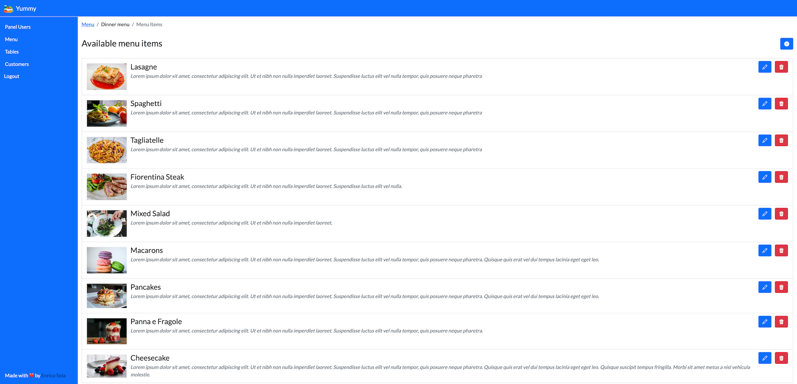

# Yummy

Simple online catering management application. Supports tables, customer and related orders management as well as menus, sections, and menu items management. Furthermore, a public section is available for customers that allows them to view the assigned menu and make orders.

This is an experimental project made while learning the Spring Framework, for this reason it is not really meant to be used in production since it may be incomplete.

### Requirements

To compile this project, make sure you have both Java (version 21 or greater) and Maven installed on your system.  
Note that the application is compiled as a .war package, for this reason you must run it inside Apache Tomcat (version 10 or greater) or similar software.

### Installation

Before compiling and running the software, you need to customize configuration in `application.properties`, then you can compile the application as a .war package running this command: `mvn package`

If you prefer, you can run this application as a Docker image, more information [here](https://hub.docker.com/r/enricosola/yummy).

## License

This work is licensed under a
[Creative Commons Attribution-NonCommercial-ShareAlike 4.0 International License][cc-by-nc-sa].

[![CC BY-NC-SA 4.0][cc-by-nc-sa-image]][cc-by-nc-sa]

[cc-by-nc-sa]: http://creativecommons.org/licenses/by-nc-sa/4.0/
[cc-by-nc-sa-image]: https://licensebuttons.net/l/by-nc-sa/4.0/88x31.png
[cc-by-nc-sa-shield]: https://img.shields.io/badge/License-CC%20BY--NC--SA%204.0-lightgrey.svg

Developed with ❤️ by [Enrico Sola](https://www.enricosola.dev).
